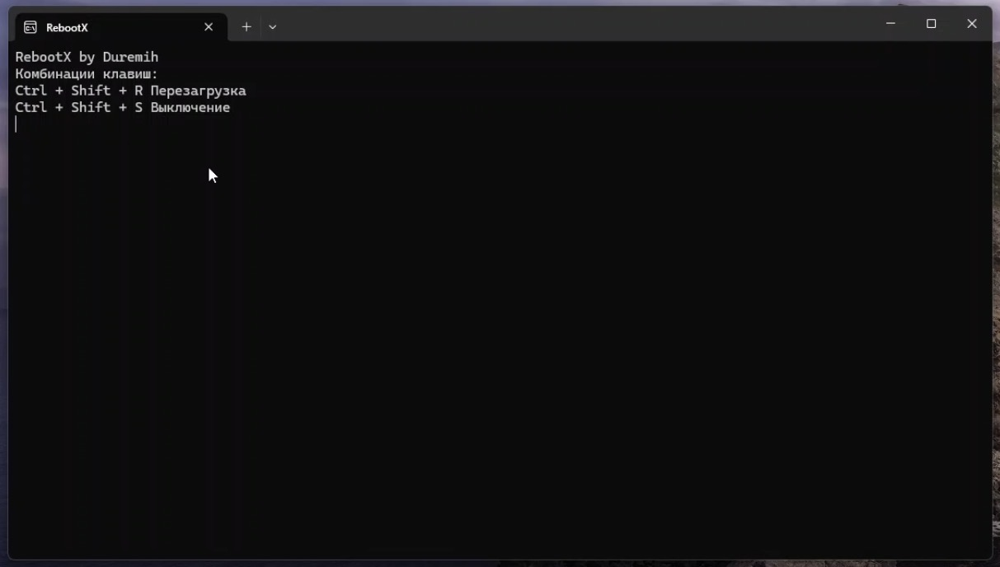

# RebootX

**RebootX** is a simple program for **rebooting and shutting down** your computer.  
Currently, the localization is only in **Russian**, but English support will be added in the future.

---

## Features
- **Hotkeys**:
  - `Ctrl + Shift + S` → Shutdown  
  - `Ctrl + Shift + R` → Reboot  
- After **10 seconds**, the program minimizes the console and continues to run in the background.  
- If **explorer.exe** (or another critical process) crashes, the computer will automatically reboot.  

---

## Screenshot

---
